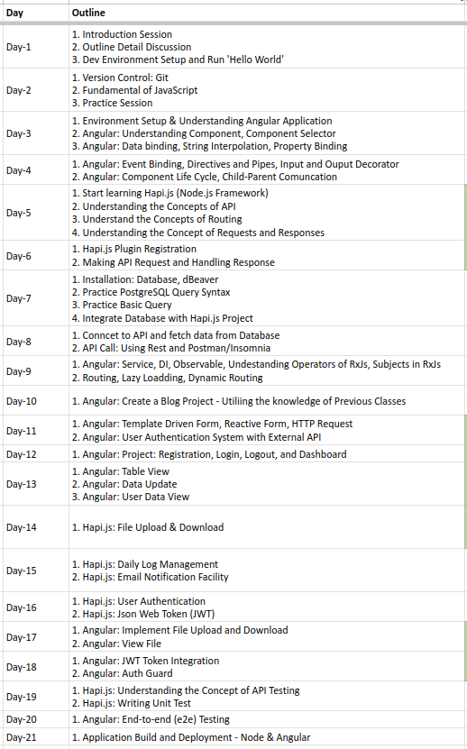

# NBR Training Session

## Training Outline

## Node.js

- To create a New Node.js project: `npm init`
- To Run a JS file with Node: `node FILE_NAME.js`
- Node.js download link: https://nodejs.org/en/download
- Git Download Link (Windows): https://git-scm.com/download/win
- GitHub Link: https://github.com/

## Angular

- Angular Documentation: https://angular.io/guide/what-is-angular

## To Install Packages

- npm install -g nodemon
- npm install @hapi/hapi
- npm install hapi-auto-route
- npm install hapi-rate-limit
- npm install pg

## Install Software

- dBeaver: https://dbeaver.io/files/dbeaver-ce-latest-x86_64-setup.exe
- Postgres: https://sbp.enterprisedb.com/getfile.jsp?fileid=1258655
